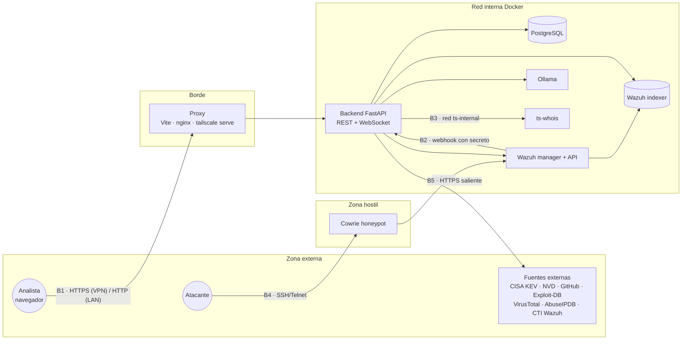

# Modelo de amenazas STRIDE

Análisis de amenazas de Valhalla SOC (Práctica 3, septiembre de 2026). Para cada amenaza se
indica la mitigación implantada, dónde se comprueba (prueba automática de `backend/tests`,
etiquetada con su requisito en la [matriz de trazabilidad](TRAZABILIDAD.md), o el fichero
donde vive el control) y el riesgo que queda.

## 1. Alcance y fronteras de confianza

| Frontera | Qué separa | Suposición de confianza |
|---|---|---|
| **B1** Usuario → consola | Navegadores de analistas (LAN o VPN) y el backend | Nada del cliente es fiable: sesión, rol, IP y cabeceras se validan en el servidor. |
| **B2** SIEM → backend | Wazuh y la API | Solo se acepta el webhook con secreto compartido o firma HMAC. |
| **B3** Backend → servicios internos | API, BD, Wazuh, Ollama, ts-whois | Red Docker interna; credenciales en `.env`; ts-whois en una red aislada (`ts-internal`). |
| **B4** Atacante → honeypot | Internet/laboratorio y Cowrie | **Todo lo que llega del honeypot es hostil**: usuarios, contraseñas y comandos se tratan como datos, nunca como código. |
| **B5** Backend → fuentes externas | API y servicios de terceros | Las respuestas externas pueden estar manipuladas: se validan, se limitan y no se interpretan como HTML. |

## 2. Amenazas y mitigaciones

### S — Suplantación de identidad

| # | Amenaza | Mitigación | Comprobación | Riesgo residual |
|---|---|---|---|---|
| S1 | Fuerza bruta contra el login | Límite de 5 intentos/min **por IP real** y bloqueo temporal de usuario tras fallos repetidos | `security.py`; RNF-02 | Bajo |
| S2 | Falsificar la IP (`X-Forwarded-For`) para esquivar límites o la auditoría | La cabecera solo se lee si la conexión viene de un proxy de confianza; la cadena se recorre desde la derecha | `test_ip_real_solo_desde_un_proxy_de_confianza`, `test_lo_que_anade_el_cliente...` | Bajo |
| S3 | Robo o reutilización de sesión | JWT en cookies `HttpOnly`/`SameSite` (`Secure` por HTTPS), `jti` único, revocación al cerrar sesión, *refresh* con rotación | `test_logout_revoca_el_token`, `test_cookies_secure_...` | Medio si se entra por HTTP en la LAN (cookie sin `Secure`) |
| S4 | Webhook de alertas falso | Secreto compartido o firma HMAC-SHA256 del cuerpo | `test_webhook_sin_secreto_se_rechaza` | Bajo |
| S5 | Alguien entra por la VPN con la cuenta de otro | Identidad de Tailscale por sesión; vinculación en el primer acceso; alerta auditada `TS_MISMATCH` | `test_alerta_si_la_cuenta_de_vpn_no_es_la_vinculada` | Medio: la vinculación es de confianza en el primer uso |
| S6 | Enlace de invitación interceptado o adivinado | Token de 256 bits de un solo uso, 24 h, en el fragmento de la URL (no llega a registros); solo se guarda su SHA-256 | `test_activacion_de_un_solo_uso`, `test_invitacion_usa_la_url_https_y_guarda_solo_el_hash` | Bajo; el canal de envío (WhatsApp, correo) queda fuera de nuestro control |

| S7 | Uso de la API de Wazuh con la credencial de fábrica (`wazuh-wui`) desde la red local o desde el contenedor atacante | **Corregido el 26/09/2026**: contraseña propia por instalación (`WAZUH_API_PASSWORD`, aplicada por el manager al arrancar con `API_PASSWORD`), puerto 55000 publicado solo en `127.0.0.1` y atacante en una red aislada | El backend se autentica con la contraseña nueva; `ss` muestra 55000 solo en 127.0.0.1; desde el atacante, manager:55000 no es alcanzable | Bajo |
| S8 | Usuarios de demostración del indexador (`kibanaserver`, `readall`, `logstash`, `kibanaro`, `snapshotrestore`, `anomalyadmin`) con su contraseña pública | **Corregido el 26/09/2026**: `init-security.sh` v2 fija la contraseña de `kibanaserver` (`DASHBOARD_PASSWORD`, distinta de la de `admin`) y elimina los demás | La API de seguridad del indexador lista solo `admin` y `kibanaserver` | Bajo |
| S9 | Contraseña de PostgreSQL de ejemplo (pública en el repositorio) en instalaciones nuevas | `setup_env.py` genera una aleatoria al crear el `.env` (antes se quedaba `replace-with-real-pass`) | `scripts/setup_env.py` | Bajo en instalaciones nuevas; las existentes deben revisar su `.env` |

### T — Manipulación

| # | Amenaza | Mitigación | Comprobación | Riesgo residual |
|---|---|---|---|---|
| T1 | CSRF: una web ajena ejecuta acciones con la sesión del analista | Doble cookie CSRF en toda escritura; verificación de `Origin` en el WebSocket | `test_escritura_sin_token_csrf_se_rechaza` | Bajo |
| T2 | Alterar un informe ya emitido | Informe congelado con huella SHA-256 de su contenido canónico; verificación bajo demanda | `test_verificacion_detecta_un_informe_alterado` | Bajo (quien controle la BD puede recalcular la huella: no es una firma) |
| T3 | Inyección de HTML/JS (XSS) en incidentes, chat o runbooks | Validación Pydantic, eliminación de etiquetas, React escapa la salida; el mapa construye nodos DOM en lugar de HTML | `test_html_en_el_titulo_se_neutraliza`, `test_html_del_mensaje_se_neutraliza` | Bajo |
| T4 | Datos hostiles del honeypot (usuarios/comandos del atacante) en consultas del SIEM | Consultas parametrizadas en OpenSearch; identificadores de hunting por lista blanca; ventanas acotadas | `test_hunting_rechaza_consultas_y_ventanas_no_validas` | Bajo |
| T5 | Adjuntos maliciosos en el chat | Lista blanca de tipos, 2 MB, base64 verificado y coherente con el tipo declarado | `test_adjuntos_validados` | Bajo |
| T6 | Dependencias o imágenes manipuladas (cadena de suministro) | Versiones fijadas (`requirements.txt`, `package-lock.json` con `npm ci`, Ollama 0.34.4, Cowrie por digest) y auditoría con pip-audit, npm audit y Trivy | [SECURITY.md](../SECURITY.md) | Medio: las imágenes de Wazuh y PostgreSQL se fijan por versión, no por digest |

### R — Repudio

| # | Amenaza | Mitigación | Comprobación | Riesgo residual |
|---|---|---|---|---|
| R1 | Un usuario niega haber hecho un cambio | Auditoría de toda escritura: usuario, IP real, ruta y código de resultado | `test_toda_escritura_queda_auditada_sin_el_cuerpo` | Medio: la auditoría vive en la misma BD que administra el administrador |
| R2 | Cambios en incidentes sin rastro | Historial por incidente (fase, severidad, notas, asignación, resolución y clasificación) | `test_ciclo_de_vida_del_incidente_queda_en_el_historial` | Bajo |
| R3 | Pérdida de registros de auditoría | Los fallos al auditar se registran como error (antes se perdían en silencio: 25/09/2026, 18:25-18:41 UTC) | `main.py` (`AuditMiddleware`) | Bajo |

### I — Divulgación de información

| # | Amenaza | Mitigación | Comprobación | Riesgo residual |
|---|---|---|---|---|
| I1 | Leer mensajes directos ajenos | Solo sus dos participantes, **tampoco el administrador**; el WebSocket solo envía cada mensaje a quien puede verlo | `test_mensaje_directo_solo_lo_leen_sus_participantes` | Bajo |
| I2 | Exposición de IPs y ubicación de los compañeros | La IP y la identidad VPN solo las ve el administrador o el propio usuario | `test_presencia_muestra_la_ip_solo_al_admin_y_al_propio_usuario` | Bajo |
| I3 | Contraseñas o secretos en registros | La auditoría nunca guarda el cuerpo; tokens de invitación como hash; contraseña del keystore por stdin | `test_toda_escritura_queda_auditada_sin_el_cuerpo`, `scripts/wazuh_post_install.sh` | Bajo |
| I4 | Datos del SOC enviados a un servicio de IA externo | IA 100 % local (Ollama en la red interna, puerto solo en `127.0.0.1`) | `docker-compose.yml` | Bajo |
| I5 | Tráfico sin cifrar por la VPN | Desde la VPN solo HTTPS (`tailscale serve`); cortafuegos que cierra a Tailscale todos los puertos de Docker | `scripts/vpn-firewall.sh` | Medio en la LAN, donde la consola sigue por HTTP |
| I6 | Secretos en el historial de Git | `.env`, certificados y copias de BD fuera del repositorio (`.gitignore`); los certificados se generan en cada instalación | `scripts/gen_certs.sh` | **Alto hasta limpiar el historial**: commits antiguos contienen certificados de Wazuh y copias de BD (pendiente de reescritura con `git filter-repo`) |

### D — Denegación de servicio

| # | Amenaza | Mitigación | Comprobación | Riesgo residual |
|---|---|---|---|---|
| D1 | Inundar la API de escrituras | Límite por IP real en escrituras; *slowapi* en login e invitaciones | `security.py` | Medio: las lecturas no se limitan (el panel hace *polling*) |
| D2 | Inundar el chat | 20 mensajes cada 10 s por usuario | `main.py` (`_chat_rate_ok`) | Bajo |
| D3 | Consultas de hunting o informes muy costosos | Ventanas acotadas (1-720 h), tamaños máximos, IA opcional en informes | `test_hunting_rechaza_consultas_y_ventanas_no_validas` | Medio |
| D4 | El honeypot consume los recursos del SOC o sirve de trampolín hacia él | Cowrie y el atacante del laboratorio en la red `lab-net`, sin acceso a la BD, al manager, al indexador ni a Ollama; límites de memoria en los servicios de Wazuh | Comprobado con `nc` desde el atacante: solo alcanza el honeypot y la API autenticada | Medio: Cowrie y el backend sin límites de CPU/memoria |
| D5 | Sondas internas que generan ruido en el SIEM | El chequeo de salud ya no conecta al honeypot (antes: ~2.400 sesiones falsas al día) | `main.py` (`_container_running`) | Bajo |

### E — Elevación de privilegios

| # | Amenaza | Mitigación | Comprobación | Riesgo residual |
|---|---|---|---|---|
| E1 | Un lector o reportero ejecuta acciones de analista o administrador | Roles comprobados en cada endpoint del servidor | `test_solo_admin_lista_usuarios`, `test_lector_y_reportero_no_crean_runbooks`, `test_metricas_solo_para_admin_y_analista` | Bajo |
| E2 | Un usuario se autoasigna rol o rango | Solo el administrador cambia usuario, rol o rango; roles por lista cerrada | `test_crear_usuario_valida_rol_y_contrasena` | Bajo |
| E3 | Dejar la plataforma sin administrador | No se puede degradar ni borrar al último administrador, ni borrarse a uno mismo | `test_no_se_puede_quitar_el_rol_al_ultimo_admin`, `test_no_se_puede_borrar_a_uno_mismo...` | Bajo |
| E4 | Compromiso del backend → control de la VPN | El socket de tailscaled solo lo monta `ts-whois`, sin root, sin capacidades, solo lectura, en una red a la que solo llega el backend | `docker-compose.yml` (`ts-whois`) | Bajo |
| E5 | Escape desde el honeypot al host | Cowrie es una emulación (no hay shell real) en imagen *distroless* | Imagen oficial de Cowrie | Bajo |

## 3. Riesgos residuales priorizados

Corregidos en esta revisión: S7 (credencial de fábrica de la API de Wazuh), S8 (usuarios de demostración del indexador), S9 (contraseña de PostgreSQL de ejemplo) y el acceso del contenedor atacante al núcleo del SOC (D4).

| Prioridad | Riesgo | Acción |
|---|---|---|
| 🔴 Alta | Certificados de Wazuh y copias de BD en el historial de Git (I6) | Reescribir el historial con `git filter-repo`, forzar la subida y regenerar los certificados. Requiere coordinar con el equipo antes de la entrega. |
| 🟠 Media | Consola por HTTP en la red local (S3, I5) | Usar el perfil `prod` (nginx con TLS) o `tailscale serve` también en la LAN. |
| 🟠 Media | Vinculación VPN por confianza en el primer uso (S5) | Vincular solo la cuenta que acepta la invitación de Tailscale (ya se hace cuando hay `TAILSCALE_API_KEY`). |
| 🟠 Media | Auditoría modificable por el administrador de la BD (R1) | Exportar la auditoría al SIEM (append-only) o firmarla. |
| 🟠 Media | Sin límites de recursos por contenedor (D4) | `mem_limit`/`cpus` en `docker-compose.yml`. |
| 🟡 Baja | 44 CVE sin parche en la imagen base Debian del backend y 22 en el binario de `esbuild` (Go 1.23) | Reconstruir periódicamente (el Dockerfile ya aplica `apt-get upgrade`); pasar a Vite 7 cuando se valide. |
